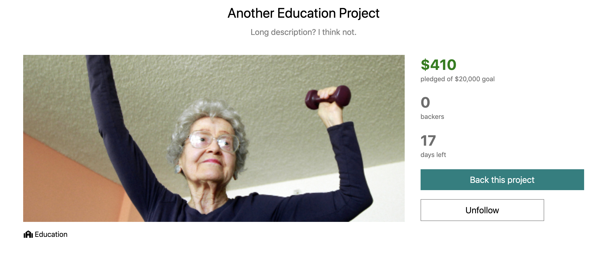
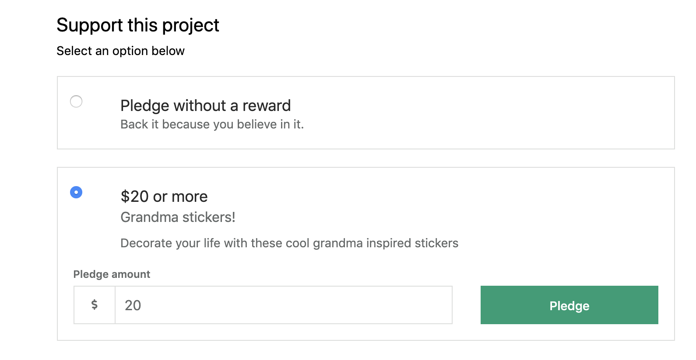

<!-- # KickStarter Clone

## Models
* Users
  * Name - String
  * Email - String
  * Password - String
  * Projects - Array
  * Backed Projects - Array
  * Followed Projects - Array
  * Funbucks
* Pledges?
* Projects
  * Name - String
  * Goal - Int
  * Amount Raised - Int
  * Backers - Array?
  * Time Limit - Int
  * Description - String
  * Comments - Array
  * Updates - Array
  * Rewards - Array
  * Category - ID
* Comments - Project
  * Body - String
  * Author ID - ID
* Categories
  * Name - String
  * Projects - Array
* Rewards - Project
* Updates - Project -->

# PunchEnder
PunchEnder is a clone of the popular crowd sourcing website KickStarter. PunchEnder allows users who have a product or campaign idea to put that idea online in hopes of getting funding from the public. All users, including users who do not create a project, can fund projects to help make them a reality. They can give any amount that they like, or give a particular amount and be rewarded by the project creator.

### Link https://punchender.herokuapp.com/#/

## Technologies & Technical Challenges
Backend: MongoDB and Node.js
Frontend: React, GraphQL, Apollo
Style: HTML and CSS

## Key Features & Implementation
### Backing Projects
#### Feature
Backing projects allows users to contribute to a users idea that needs funding. Users can track the projects that they have backed and the project will track how much has been raised.



#### Implementation
Backing a project affects the records of three different tables. This creates a new Pledge records, modifies the Users funds, and the projects amount raised. This is all done through a single GraphQL mutation. The information sent back from the mutation is what updates the project show page.

```JavaScript
  PLEDGE_PROJECT: gql`
    mutation PledgeProject($user_id: ID!, $project_id: ID!, $reward_id:ID, $pledgeAmount: Int!) {
      pledgeProject(user_id: $user_id, project_id: $project_id, reward_id: $reward_id, pledgeAmount: $pledgeAmount) {
        _id
        project {
          _id
          name
          amountRaised
        }
        reward {
          _id
          name
        }
        amount
      }
    }
  `

  pledgeProject: {
    type: PledgeType,
    args: {
      user_id: { type: new GraphQLNonNull(GraphQLID) },
      project_id: { type: new GraphQLNonNull(GraphQLID) },
      reward_id: { type: GraphQLID },
      pledgeAmount: { type: new GraphQLNonNull(GraphQLInt) }
    },
    async resolve(_, variables, context) {
      const validUser = await AuthService.verifyUser({ token: context.token });

      if (validUser.loggedIn) {
        let pledge = new Pledge({
          pledger: variables.user_id,
          project: variables.project_id,
          reward: variables.reward_id,
          amount: variables.pledgeAmount 
        })
        await User.findByIdAndUpdate(variables.user_id, {
          $inc: {
            funBucks: -(variables.pledgeAmount)
          },
          $push: {
            backedProjects: variables.project_id
          }},
          { new: true }
        )
        await Project.findByIdAndUpdate(variables.project_id, {
          $inc: {
            amountRaised: variables.pledgeAmount
          }},
          { new: true }
        )
        return pledge.save()
      } else {
        throw new Error("sorry, you need to log in first");
      }
    }
  }
```

### Rewards
#### Feature
When users are backing a project they have the choice of donating money for the greater good, or they can give money to the project for a reward. Rewards are usually products or services given the the user that donates to the projects. A project can have multiple tiers of rewards given for various increments that are pledged to a project.



#### Implementation
Rewards are created by the project owner using a GraphQL mutation. When a user pledges to a project 

```JavaScript
  const [createReward] = useMutation(
    CREATE_REWARD,
    {
      update(cache, { data: { newReward } }) {
        try {
          const qdata = cache.readQuery({ query: FETCH_UNFINISHED_PROJECT, variables: { _id: project._id } });
          qdata.project.rewards.push(newReward);
          cache.writeQuery({
            query: FETCH_UNFINISHED_PROJECT,
            variables: { _id: project._id },
            data: { project: qdata.project },
          });
        } catch {

        }
      }
  });

  const { loading, error, data } = useQuery(
    Queries.FETCH_FINISHED_PROJECT,
    { variables: { _id: projectId } }
  );
  if (loading) { return null };
  if (error) { return <div>Error!</div> };
  const { project } = data;
  const rewards = Array.from(data.project.rewards);
```

### Functionality & MVP
* Projects - Users can create charitable projects that can be completely funded by our community of users. Creating a project entails adding details, a goal for funding, and rewards that users can get for backing a project.

* Backing projects & rewards - Users that explore PunchEnder can find projects that they are interested in and can back those projects through funding them. When a project is backed, the user backing the project can choose to fund a specific amount to get a reward from the user that is creating the project. This is usually a gesture or special gift for being backed.

* Search - Find projects based off of the title or other key information in the project with our search feature.

* Categories / Discover feature - The root page of PunchEnder will show a complete list of the projects that are hosted on our site. To make the browsing of the projects a bit easier, users can filter the list of projects down by browsing by category.

* Likes - Users are able to show support for a particular project by liking a project. They can then see the list of projects that they have supported under their user profile.


## Future Concepts
#### Credit card payments

### Collaborators
Jasim Atiyeh, Han Kyul Kim
