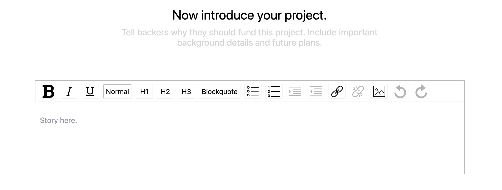

<!-- # KickStarter Clone

## Models
* Users
  * Name - String
  * Email - String
  * Password - String
  * Projects - Array
  * Backed Projects - Array
  * Followed Projects - Array
  * Funbucks
* Pledges?
* Projects
  * Name - String
  * Goal - Int
  * Amount Raised - Int
  * Backers - Array?
  * Time Limit - Int
  * Description - String
  * Comments - Array
  * Updates - Array
  * Rewards - Array
  * Category - ID
* Comments - Project
  * Body - String
  * Author ID - ID
* Categories
  * Name - String
  * Projects - Array
* Rewards - Project
* Updates - Project -->

# PunchEnder
PunchEnder is a clone of the popular crowd sourcing website KickStarter. PunchEnder allows users who have a product or campaign idea to put that idea online in hopes of getting funding from the public. All users, including users who do not create a project, can fund projects to help make them a reality. They can give any amount that they like, or give a particular amount and be rewarded by the project creator.

### Link https://punchender.herokuapp.com/#/

## Technologies & Technical Challenges
Backend: MongoDB and Node.js
Frontend: React, GraphQL, Apollo
Style: HTML and CSS

## Key Features & Implementation
### Backing Projects
#### Feature
Backing projects allows users to contribute to a users idea that needs funding. Users can track the projects that they have backed and the project will track how much has been raised.


#### Implementation
Backing a project affects the records of three different tables. This creates a new Pledge records, modifies the Users funds, and the Projects amount raised. This is all done through a single GraphQL mutation. The information sent back from the mutation is what updates the project show page.

```JavaScript
  PLEDGE_PROJECT: gql`
    mutation PledgeProject($user_id: ID!, $project_id: ID!, $reward_id:ID, $pledgeAmount: Int!) {
      pledgeProject(user_id: $user_id, project_id: $project_id, reward_id: $reward_id, pledgeAmount: $pledgeAmount) {
        _id
        project {
          _id
          name
          amountRaised
        }
        reward {
          _id
          name
        }
        amount
      }
    }
  `

  pledgeProject: {
    type: PledgeType,
    args: {
      user_id: { type: new GraphQLNonNull(GraphQLID) },
      project_id: { type: new GraphQLNonNull(GraphQLID) },
      reward_id: { type: GraphQLID },
      pledgeAmount: { type: new GraphQLNonNull(GraphQLInt) }
    },
    async resolve(_, variables, context) {
      const validUser = await AuthService.verifyUser({ token: context.token });

      if (validUser.loggedIn) {
        let pledge = new Pledge({
          pledger: variables.user_id,
          project: variables.project_id,
          reward: variables.reward_id,
          amount: variables.pledgeAmount 
        })
        await User.findByIdAndUpdate(variables.user_id, {
          $inc: {
            funBucks: -(variables.pledgeAmount)
          },
          $push: {
            backedProjects: variables.project_id
          }},
          { new: true }
        )
        await Project.findByIdAndUpdate(variables.project_id, {
          $inc: {
            amountRaised: variables.pledgeAmount
          }},
          { new: true }
        )
        return pledge.save()
      } else {
        throw new Error("sorry, you need to log in first");
      }
    }
  }
```

### Rewards
#### Feature
When users are backing a project they have the choice of donating money for the greater good, or they can give money to the project for a reward. Rewards are usually products or services given by the user as donates to the projects. A project can have multiple tiers of rewards given for various increments that are pledged to a project.


#### Implementation
Rewards are created by the project for each project. Rewards are recorded and prsented in an ordered list to display them in an increasing order. The ordering is tracked through an array saved to the project that is mapped over to display them on the page.

```JavaScript
  const tier = rewards ? rewards.length + 1 : 1;

  <div className="reward-form-container" ref={this.container}>
    <h2>Add a tier {this.props.tier} reward</h2>
    <span>{message}</span>
    <form className="reward-form" onSubmit={e => e.preventDefault()}>
      <div>
        <label>Title</label>
        <input type="text" value={name} onChange={e => setName(e.target.value)} />
        <label>Pledge Amount</label>
        <div className="reward-input-group">
          <div className="reward-input-group-sign">$</div>
          <input type="number" value={pledgeAmount} onChange={e => setPledgeAmount(e.target.value)} />
        </div>
        <label>Description</label>
        <textarea id="reward-textarea" maxLength={135} value={description} onChange={e => setDescription(e.target.value)} />
      </div>
    </form>
  </div>

  {rewards.map((reward, idx) => (
    <RewardTile
      num={idx + 1}
      show={show}
      setShow={setShow}
      key={idx}
      projectId={project._id}
      ownProps={props}
      reward={reward} />
  ))}
```

### Text Editor
#### Feature
Users are given a long description, called a story, when creating a project. This is useful in letting the user explain all of the details of their project, and their backstory. We wanted to give the user more than just a text box. Giving them the option to put in images of their project, hyperlink to their website, and text formating for a nicer looking message.



#### Implementation
<!--Josh: We need to discuss how the text editor was added to the app. You can focus on how the editor was setup with the options. Feel free to change any code snippets you want.-->
Currently, the text editor used in the project is borrowed from a library called [react-draft-wysiwyg](https://github.com/jpuri/react-draft-wysiwyg). While the editor originally was a custom one created with SlateJS, the previous editor had a bug that was not resolved by the library at the time. While using older versions of SlateJS was also an option, a call was made to use a pre-built editor made with Draft.js. In the future, a custom-built editor may replace the current one. 

##### Calling Editor in the project form
```JavaScript
  <Editor needSave={needSave} setNeedSave={setNeedSave} story={story} setStory={setStory}/>
```
##### Importing editor from Draft JS
```JavaScript
  import { Editor } from 'react-draft-wysiwyg';
  import { EditorState, convertToRaw, convertFromRaw } from 'draft-js';

  render() {
    return (
      <Editor
        placeholder="Story here."
        editorState={this.state.editorState}
        toolbarClassName="story-toolbar"
        wrapperClassName="story-wrapper story-write-wrapper"
        editorClassName="story-editor"
        onEditorStateChange={this.onChange}
        toolbar={tboptions}
      />
    )
  }
```

##### Options given to Draft JS to display in the editor
```JavaScript
  options: ['inline', 'blockType', 'list', 'link', 'image', 'history']
```

## Future Concepts
#### Credit card payments
Implementing a credit card payment system would be the next logical step for our project. This will allow the users to fund their accounts and back projects.

#### Category Creation
It would be important to have a way for more categories to be added. It would be useful to have user create a category when a new one is needed. If they have a project that will not fit into one of our current categories.

### Collaborators
Jasim Atiyeh, Han Kyul Kim
